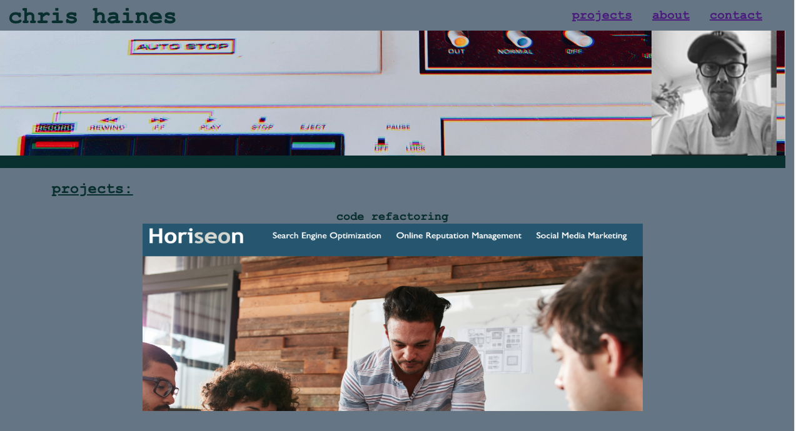
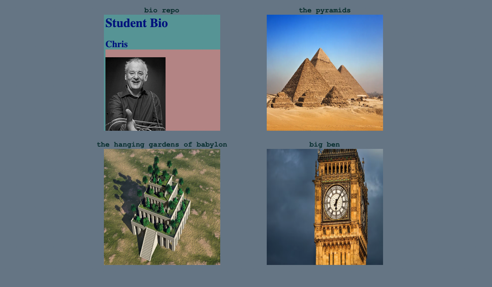
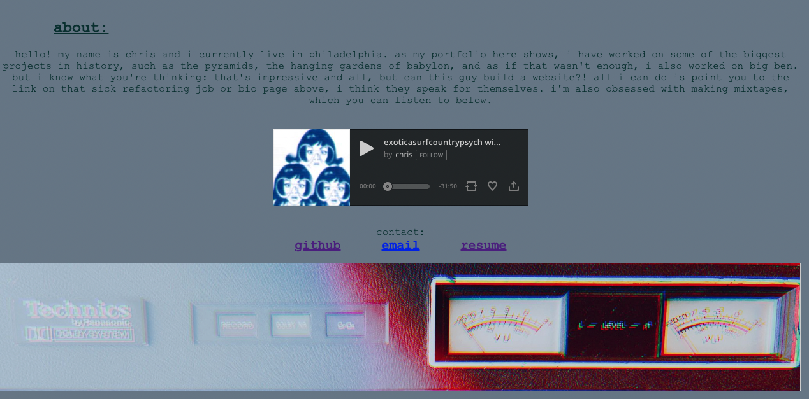

# Portfolio

## Purpose

The purpose of this portfolio was to create a basic application with links to projects I have worked on and be able to add to as I work on more projects in the future. It should be structured with proper semantic HTML tags, alt attributes for all images, and id's and classes all make sense.

It contains my name, a recent photo, my recent projects, and links to places to contact me. The nav bar has links to all of those sections. My first application shown on the page is larger than the others, and the layout is responsive to various screens and devices.

## Screenshot

## Deployed Page Link 

https://cmhaines215.github.io/portfolio/

## Github Repository Link

https://github.com/cmhaines215/portfolio